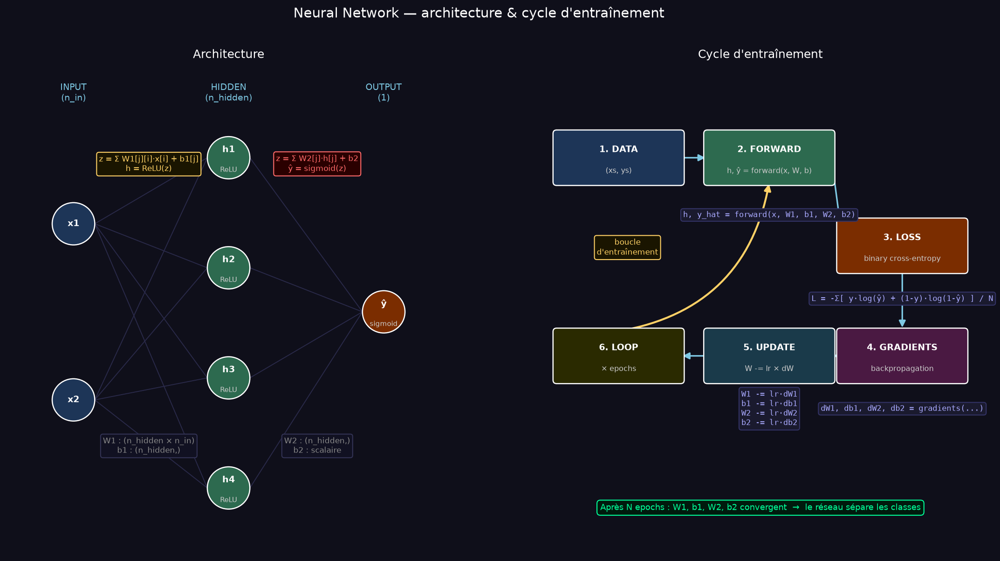
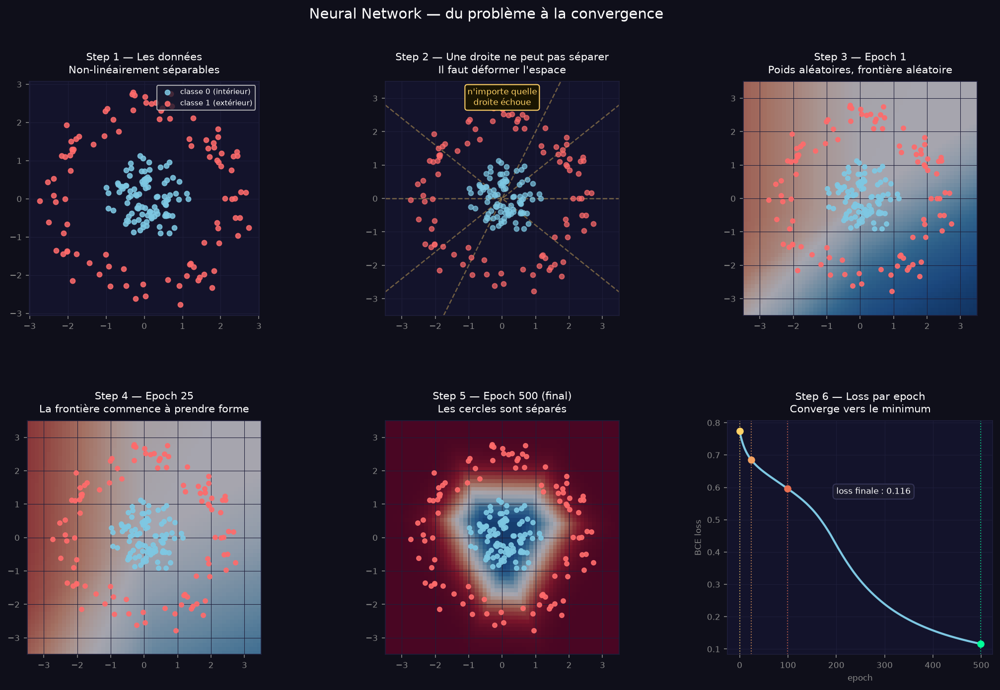
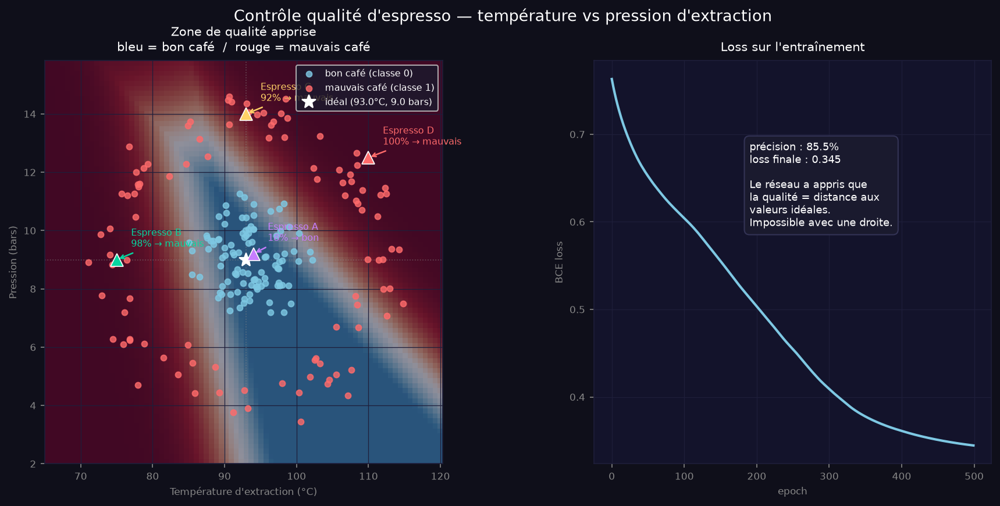

# neural-network-from-scratch

Réseau de neurones codé en Python pur, sans aucune librairie ML.

Diagramme of the algorithm:

Classifie des données en cercles concentriques — un problème qu'une régression linéaire ne peut pas résoudre. La couche cachée déforme l'espace pour rendre les classes séparables.

**Ce qui est implémenté à la main :**
- `relu`, `sigmoid` — fonctions d'activation
- `forward` — passage d'un point à travers le réseau
- `loss` — binary cross-entropy
- `gradients` — backpropagation complète
- `train` — initialisation des poids + boucle gradient descent

Training:

Example:

